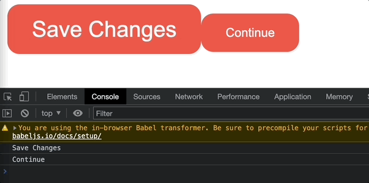

# React-btn-props
https://jun-isaac.github.io/React-btn-props/

-----------------
## 🧑🏻‍💻 구현 목표

- [x] React를 활용해서 버튼 틀 제작
- [x] React를 활용해서 버튼 데이터 변경

-----------------
## 🖼 메인프레임

* 같은 스타일의 다른 버튼들을 제작해보았습니다.
* Save Changes 버튼을 누르면 onClick 이벤트로 데이터가 Revert Changes로 변경 됩니다.

------------------
## 📕 배운 것

* 내가 만든 함수 안에 인자들을 넣고 그 인자를 활용해 버튼, div 등 안에 텍스트 변경이 가능하다.
* 다른 버튼에서 같은 스타일을 한번에 적용할 수 있다.
* 인자를 활용해 if, else문도 제작이 가능하다.
* 데이터가 변경 되지 않는 것들은 React.memo 기능을 활용해서 새로 렌더링 하지 않도록 할 수 있다.

  

### 🕹 버튼 클릭시 버튼 데이터 변경 & 변경 되지 않는 버튼은 새로 렌더링 하지 않음

  

----

## 사용 라이브러리
|React|
|---|
